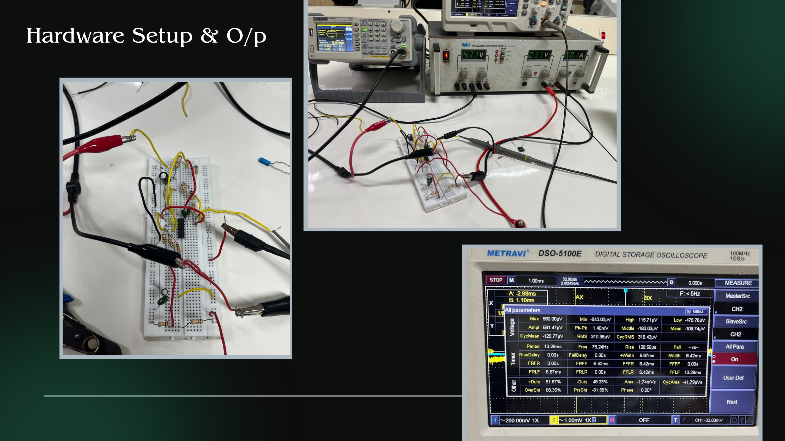
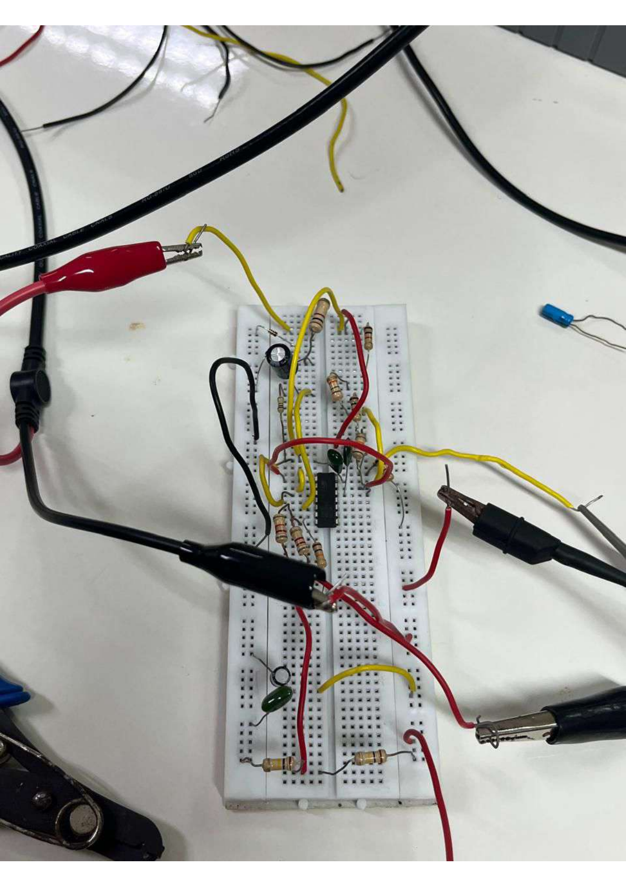
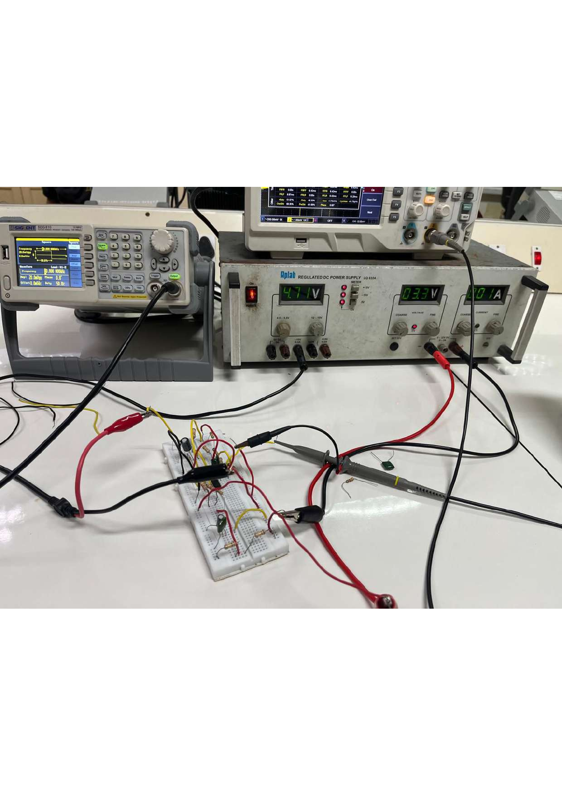
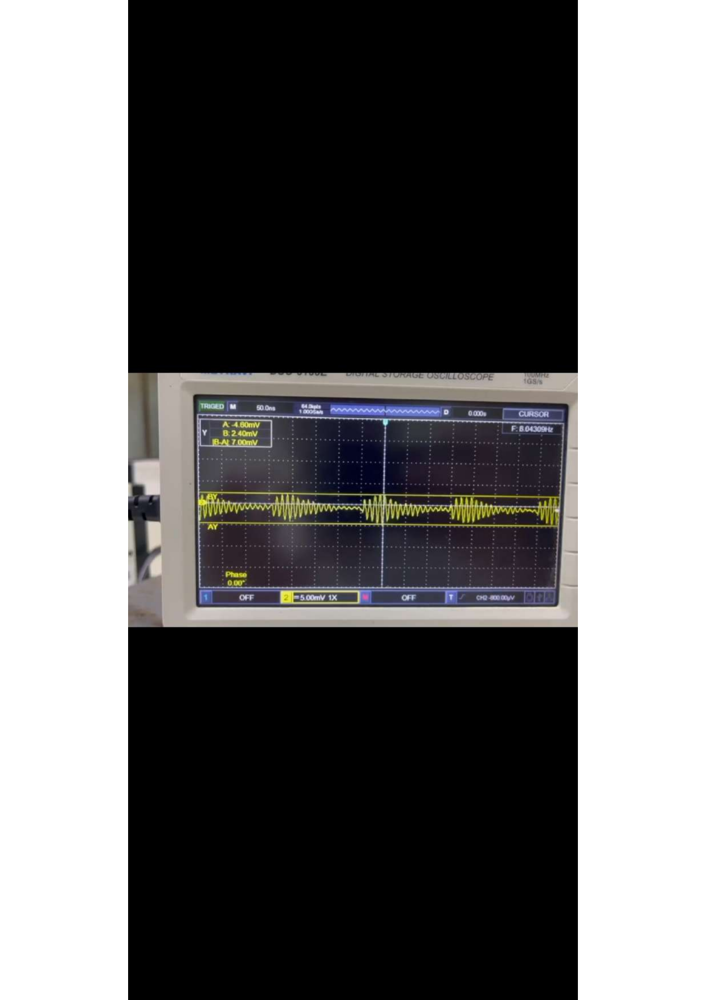
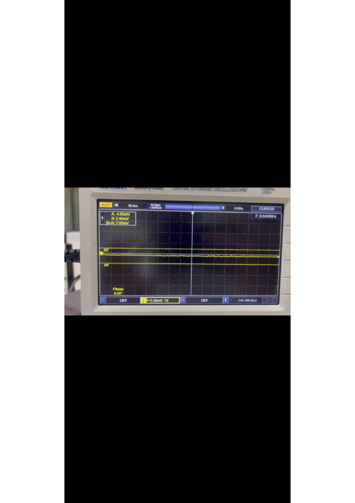

# Low-Power Analog Front-End (AFE) for IoT Sensor Nodes

Mini Project — EC280 (Electrical Circuits and Systems), NITK Surathkal
**Team:** Rayaan Ulla Shariff (241EC243), Rahul Gowda (241EC242) · **Guide:** Dr. Nikhil K. S

A discrete op-amp based analog signal-conditioning chain that takes a weak, noisy sensor
signal and turns it into a clean, buffered voltage ready for an MCU's ADC — without needing
any digital processing (and its power cost) to do the cleanup.

---

## Why this exists

IoT and wearable sensors (temperature, ECG, vibration, etc.) output signals that are small
and noisy. Two bad options exist if you skip an analog front-end:

- Feed the raw signal straight into the MCU's ADC → poor SNR, more digital filtering,
  more CPU cycles, more power.
- Over-engineer a heavy digital DSP pipeline → kills the power budget on a
  battery-powered node.

The alternative — and the point of this project — is to do the amplification and filtering
*in the analog domain*, cheaply, before the signal ever reaches the ADC.

## What it does

```
Sensor  →  Input Protection &   →  Amplification   →  Active Filtering   →  Buffer  →  MCU ADC
(weak,      Biasing Network        Stage               (noise removal)      Stage
 noisy)
```

- **Input protection & biasing:** series resistor + BAT54 clamping diode pair to protect
  the op-amp input from over-voltage, plus a bias network that centers the AC signal at the
  mid-supply rail (~1.65 V) so it can swing symmetrically on a single 3.3 V supply.
- **Amplification stage:** MCP6002-based gain stage (feedback network sized for ~100×
  voltage gain in the high-gain stage).
- **Active filtering:** a second-order low-pass stage (16 kΩ / 10 nF legs) to reject
  out-of-band noise, cutoff ≈ 1 kHz.
- **Buffer stage:** unity-gain voltage-follower so the filter output isn't loaded down by
  whatever comes next (MCU ADC input impedance, wiring, etc.).

Full schematic: [`images/schematics/ltspice-full-schematic.png`](images/schematics/ltspice-full-schematic.png)

## Simulation (LTspice)

The chain was simulated end-to-end with a 10 mV / 2 Hz sine source standing in for the
sensor signal, running on a 3.3 V rail.

| Stage | What you're looking at |
|---|---|
| `V(first)` | Biased input node — DC-shifted sine sitting on the ~2.98 V bias point |
| `V(fourth)` | After the diode-clamped amplification stage |
| `V(fifth)` | Final filtered/buffered output — ~156 mV amplitude, clean sinusoid |



LTspice netlist: [`ltspice/afe_frontend.asc`](ltspice/afe_frontend.asc) *(add your `.asc`/`.raw`
files here — see [Repo TODOs](#repo-todos-before-you-publish) below)*

## Hardware validation

Built on breadboard and tested with a signal generator, regulated DC supply, and a digital
storage oscilloscope (Metravi DSO-5100E) + true-RMS multimeter.

| | |
|---|---|
|  |  |
| Breadboard build | Bench setup: function generator + power supply + scope |

**Before / after filtering (oscilloscope):**

| Noisy input | Filtered output |
|---|---|
|  |  |

**Final buffered output (multimeter, true-RMS): 146.53 mV RMS** — same order of magnitude
as the simulated ~156 mV amplitude on `V(fifth)`, so the hardware build tracked the LTspice
prediction reasonably well given breadboard parasitics and 5% resistor tolerances.

**A note on the other scope captures:** during bench testing we probed multiple points in
the chain and swept the generator across a few test frequencies, not just the single
2 Hz tone used in simulation — visible in `scope-all-parameters.png` (RMS ≈ 310 µV,
~75 Hz) and the other amplitude-view captures, which show different frequencies again.
Those screenshots reflect **earlier stages or different test conditions**, not the same
measurement as the multimeter reading above — at the time we didn't log which probe point
and generator setting matched each screenshot, so they're included here as raw bench
evidence rather than claimed as a single consistent number. The one number we're
confident stands for "the final output" is the 146.53 mV RMS multimeter reading, taken at
the buffer stage. If asked, the honest answer is: multi-point/multi-frequency bench
characterization was done, but test-point logging wasn't rigorous enough to reconstruct
which screenshot is which after the fact — a process gap worth naming, not hiding.

## Power budget

```
P = V_CC × N_amp × I_q
P = 3.3 V × 4 × 100 µA ≈ 1.32 mW
```

Four op-amp stages (two MCP6002 dual packages) at ~100 µA quiescent current each on a
3.3 V rail → **~1.3 mW total**, an order of magnitude off the sub-10 µW state-of-the-art
(see [References](#references)), but built entirely from off-the-shelf general-purpose
op-amps rather than a custom low-power CMOS design — the honest trade-off of a
component-level (not IC-level) implementation.

## Bill of materials

| Part | Role |
|---|---|
| MCP6002 (×2, dual op-amp) | Amplification, filtering, buffering |
| BAT54 diode pair | Input over-voltage / reverse-polarity clamp |
| Resistors: 100 Ω, 10 kΩ, 16 kΩ (×2), 90 kΩ, 100 kΩ (×2), 1 MΩ | Gain-setting, biasing, filter legs |
| Capacitors: 0.1 µF, 1 µF, 10 µF, 10 nF (×2) | Bias decoupling, AC coupling, filter legs |
| 3.3 V regulated supply | System rail |

## What I'd tell an interviewer

- **The problem:** raw sensor signals are weak/noisy; doing amplification+filtering
  digitally burns power that a battery-powered IoT node can't spare.
- **The design decision:** split the chain into four purpose-built op-amp stages
  (protect → amplify → filter → buffer) instead of one do-everything stage, so each stage
  has one job and can be reasoned about / debugged independently.
- **Why the diode clamp:** BAT54s protect the amplifier input from ESD/over-voltage
  events without adding meaningful distortion to the signal path in normal operation.
- **Why a 2nd-order low-pass, not 1st-order:** steeper roll-off for the same noise-rejection
  target without needing a much higher cutoff resistor/capacitor mismatch — trade-off is
  extra component count and a slightly harder-to-tune corner frequency.
- **Why a buffer at the end:** without it, whatever load follows (MCU ADC input network,
  cabling) pulls current from the filter's output node and distorts the filtered signal.
- **The honest gap:** the final 146.53 mV RMS output tracks the ~156 mV simulated amplitude
  reasonably well, but not every bench screenshot lines up into one clean story — some
  captures were taken at different probe points / generator frequencies, and test-point
  logging wasn't rigorous enough at the time to reconstruct exactly which is which. That's
  a real process lesson (log the test point and conditions *on* the screenshot, every time),
  not a cover-up — and saying that out loud is more credible than pretending every number
  matches perfectly.
- **What's next:** move from breadboard to PCB, interface with an actual MCU ADC (ESP32/
  STM32) and read the digitized value out, and benchmark against the sub-10 µW published
  designs to see exactly where the 1.3 mW budget is being spent.

## Repo structure

```
.
├── README.md
├── docs/
│   ├── design-notes.md       ← deeper design rationale, worked-through math
│   └── proposal.pdf          ← original EC280 project proposal
├── images/
│   ├── schematics/           ← hand-drawn + LTspice schematics, IC pinouts
│   ├── simulation/           ← LTspice stage-by-stage outputs
│   └── hardware/             ← breadboard build, scope traces, multimeter readings
└── ltspice/                  ← .asc / .raw simulation files
```

## References

1. Watcharapongvinit *et al.*, "Design of a Low-Power Ground-Free Analog Front End for
   ECG Acquisition," *IEEE Transactions on Biomedical Circuits and Systems*, Apr. 2023
   — 6.55 µW AFE, two-electrode ground-free design, 0.18 µm CMOS.
2. Sung-Hun Jo *et al.*, "A Fully Reconfigurable Universal Sensor Analog Front-End IC for
   the Internet of Things Era," *IEEE Sensors Journal*, Apr. 2019 — reconfigurable AFE for
   R/C/V/I sensor types using correlated double sampling (CDS).

---

## Repo TODOs before you publish

- [ ] Drop your actual `.asc` LTspice source file into `ltspice/` (you have the sim, just
      need the source file — check your laptop/LTspice recent files if you don't have it
      saved elsewhere).
- [ ] Add a one-paragraph "Getting Started" if you want others to be able to open the sim.
- [ ] Optional: redraw the hand-drawn schematic in KiCad/EasyEDA for a cleaner repo image —
      good "polish" signal for recruiters, not required for the project to be valid.
